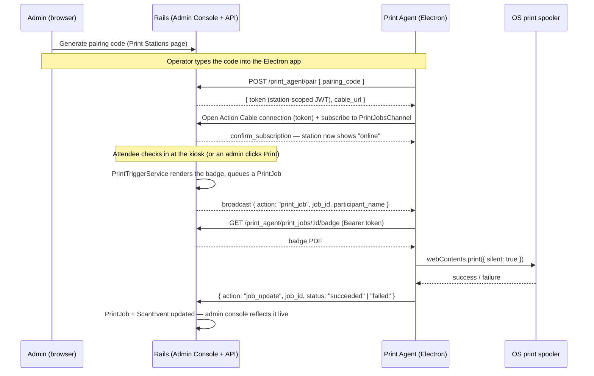

# EventMeet

A multi-tenant SaaS event management platform: organizer accounts (tenants) run events end-to-end
— ticketing, registration, badge design, on-site check-in, and a live real-time dashboard —
isolated from every other tenant on the platform. A platform operator (Super Admin) provisions
tenants, approves events before they go live, and tracks usage/billing across all of them.

Full requirements: [`backend/doc/requirement.md`](backend/doc/requirement.md). Phase-by-phase
build log (what's actually shipped, with implementation notes): [`backend/doc/implementation.md`](backend/doc/implementation.md).

## Repo layout

| Directory | Stack | Dev port | What it is |
|---|---|---|---|
| [`backend/`](backend/README.md) | Ruby on Rails 8 | `3000` | Admin Console (tenant staff) + Platform Console (Super Admin), API |
| [`frontend/`](frontend/README.md) | Next.js (TypeScript) | `5173` | Public attendee-facing event site — **not yet built**, still the default scaffold |
| [`print-agent/`](print-agent/README.md) | Electron | — | Desktop print agent — pairs with a tenant and auto-prints badges at a front-desk station |

Three independent host tiers resolve to three different apps at request time — see
`backend/doc/requirement.md` §4.3 for the full domain model:

| Host | App | Audience |
|---|---|---|
| `{platform_domain}` (apex) | Rails — Platform Console | Super Admin |
| `{tenant_slug}.{platform_domain}` | Rails — Admin Console | Tenant staff |
| `events.{platform_domain}` / a tenant's custom domain | Next.js — Public Event Site | Attendees (not yet built) |

## Getting started

```sh
cd backend && bin/setup && bin/dev     # Rails admin/platform console, http://localhost:3000
cd frontend && npm install && npm run dev   # Next.js public site scaffold, http://localhost:5173
cd print-agent && npm install && npm start  # Electron print agent
```

See each directory's own README for full local setup (multi-tenant hosts, Redis/Sidekiq, seed
data, etc.) — `backend/README.md` in particular.

Contributing? Read [`CONTRIBUTING.md`](CONTRIBUTING.md) first, especially the section on tenant
isolation — it's the one rule every change in this codebase has to respect.

## What's built

Grouped by module — each maps to one or more phases in `backend/doc/implementation.md`.

**Platform & multi-tenancy**
- Row-level tenant isolation on every tenant-scoped table (`account_id` + Postgres RLS as
  defense-in-depth), enforced structurally, not by convention
- Super-Admin-provisioned tenant onboarding from the Platform Console (no self-serve signup)
- Configurable roles per tenant (Owner, Event Manager, Check-in Staff, Finance/Read-only)

**Events**
- Tabbed event-creation workspace (Basic Info → Agenda → Tickets → Badge → Review), each tab
  autosaving independently
- `draft → up_coming → live → completed` lifecycle, auto-transitioned on schedule
- Super Admin approval gate — an event isn't visible or open for registration until approved
- Event duplication

**Ticketing**
- Capacity-based ticket categories (no payment processing in this phase)
- Group reservations and waitlisting

**Participants & registration**
- Manual admin entry, plus bulk XLSX import with fuzzy dedupe matching (govt ID → email+name →
  email → phone)
- Per-ticket-category dynamic registration form builder — default, shared, or fully custom form
  per category, ordered fields, fields a badge design references become automatically required
- Government ID pool import/assignment
- Bulk export (XLSX/CSV/PDF) with an organizer-configurable column picker

**Badge design & printing**
- Visual badge/wristband designer (GrapesJS canvas) with a reusable, account-wide template
  library
- Conditional badge layouts per ticket category (VIP vs. Attendee vs. Speaker) without duplicating
  templates
- On-demand PDF badge rendering/download

**Check-in & real-time dashboards**
- Multi-identifier scan lookup (hex ID / govt ID / RFID / client ID), 30-second anti-double-scan
  debounce
- Event- and session-level check-in/out, virtual-event redirect-on-check-in
- Live dashboards over Action Cable (registrations, check-ins, occupancy) — no page refresh,
  same real read-model both the initial load and the live push read from

**Print agent (Electron)** — see the dedicated section below
- Cross-platform desktop agent, pairs with a print station, silently auto-prints badges as part
  of the check-in scan
- Manual Print action on the participant list/show page, with a graceful PDF-download fallback
  when no station is paired
- Bulk Print: batch-limited, resumable print runs with live progress and "last printed" tracking

**Agenda, speakers & sessions**
- Multi-day/multi-track schedule builder, account-level speaker roster, per-session capacity and
  its own check-in

**Communications**
- Branded registration-confirmation email, per-participant and bulk resend
- WhatsApp (via Gupshup) for Super-Admin-to-tenant operational notifications — event
  rejection, invoice sent, quotation sent/revised, payment verified

**Reporting & analytics**
- Registrations-over-time, check-in funnel, session popularity, and engagement-funnel dashboards
  — read-model queries against denormalized counters, not expensive live `COUNT()`s

**Platform billing & invoicing**
- Basic/Pro/Business plans; Business-tier events are quotation-gated (negotiate → approve → then
  the event can be created)
- Super-Admin-adjustable capacity overage tracking
- Post-event invoicing and a manual bank-transfer (NEFT/UTR) payment-proof verification workflow

### Not yet built

- **Sponsors/Exhibitors module** — per-event sponsor tiers, booth pages, lead retrieval
- **Tenant-facing OAuth2 API** — each tenant's Doorkeeper application exists (created at
  provisioning time) but the client-credentials API surface itself isn't wired up yet
- **Cross-tenant agency SSO**, Super Admin audit log / impersonation-with-audit-trail
- **The public Next.js event site** — registration, live "seats remaining" ticker, custom-domain
  resolution. `frontend/` is currently just the unmodified `create-next-app` scaffold; every
  backend capability it depends on (approval gating, live counters, participant rules) already
  exists and is tested, deliberately built in that order

## Print Agent (Electron)

Badge printing at a front desk can't just be "the server calls `lpr`" in a multi-tenant SaaS — the
printer is physically at a customer's desk, not next to the app server. The print agent is a small
Electron app that runs on that front-desk machine: it pairs with exactly one tenant + event +
station, holds one authenticated Action Cable connection open, and silently prints whatever badge
PDF the server pushes to it — no manual "Print" click, no browser involved on that machine at all.



If no station is paired/online for an event, printing gracefully falls back to the existing
on-demand PDF download — nothing depends on the agent being connected.

An admin can revoke a station's pairing at any time from the Print Stations page, which
force-disconnects the agent's live connection immediately, not just on its next reconnect attempt.

Full wire protocol (JWT claims, message shapes, pairing/badge-fetch endpoints):
[`backend/doc/print-agent-protocol.md`](backend/doc/print-agent-protocol.md). Running it locally:
[`print-agent/README.md`](print-agent/README.md).

**Scope note:** this is a real, working agent — pairing, the live Cable connection, and silent
printing all function end-to-end — but packaging (`electron-builder` installers), code signing,
and auto-update are deliberately not built yet; it runs via `npm start` in development. See the
protocol doc for the full list of what's intentionally deferred.

## CI

GitHub Actions (`.github/workflows/ci.yml`) runs backend (Rubocop, Brakeman, RSpec) and frontend
(lint, build) checks independently on every push and pull request.
